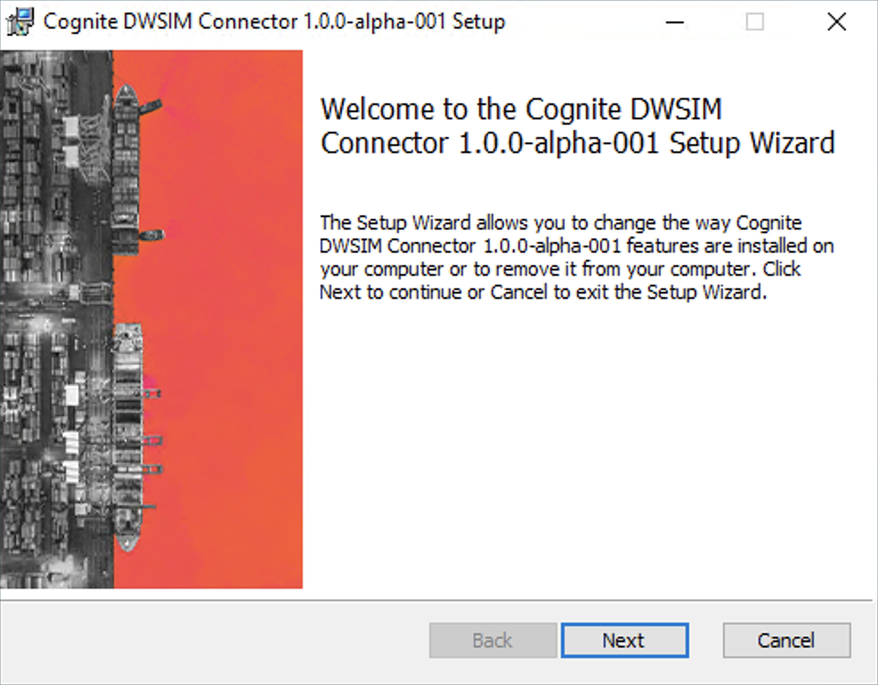
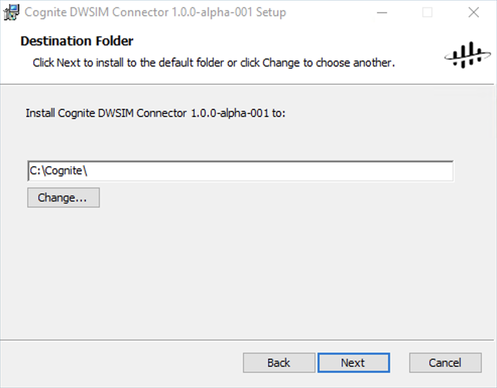
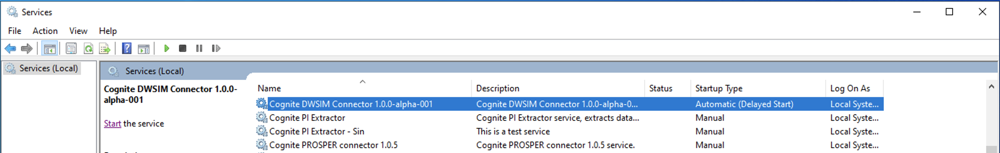
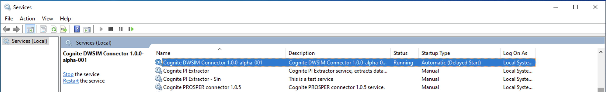
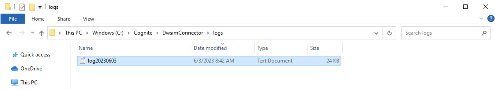
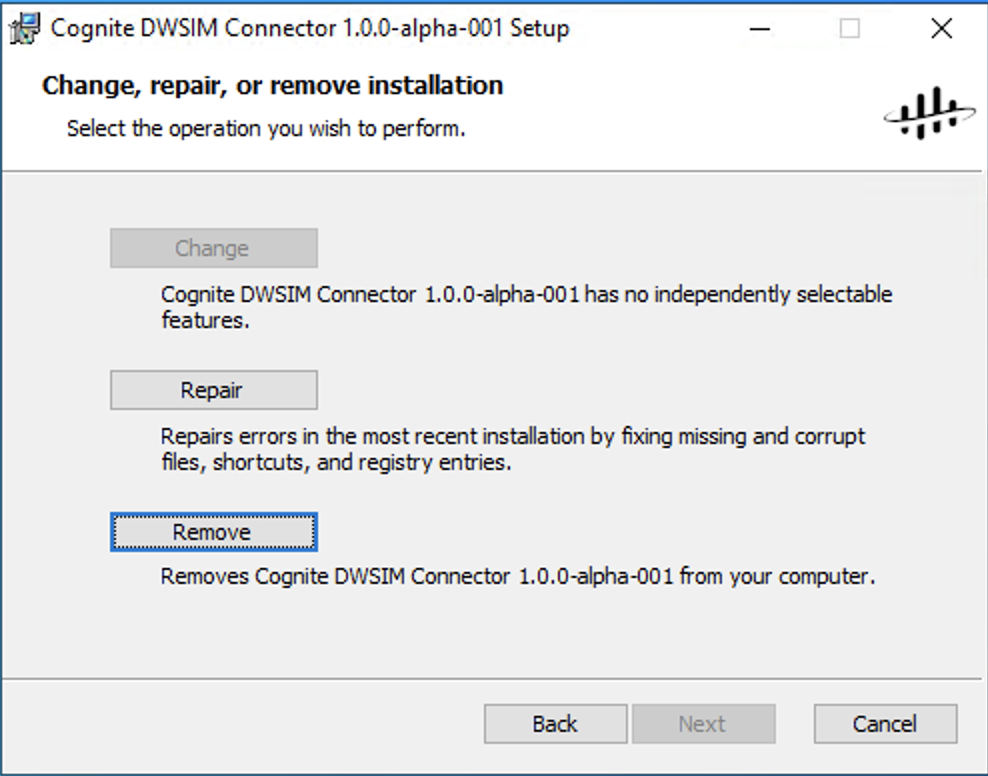

# Cognite DWSIM connector

## Requirements
**Minimum hardware requirements**

- 4 vCPUs (general-purpose VM)
- 16 GB RAM
- 256 GB HD for logging and storage

The requirements for DWSIM may be higher, should accommodate for that

**Software requirements**

- Windows Server 2016 or higher
- DWSIM installed. DWSIM is an open source simulator. It can be downloaded from https://dwsim.org/index.php/download/.
  - The connector was built to integrate with DWSIM version 8.4.3. Newer versions may work, but they are not tested.
- .NET 6.0 runtime

**Additional CDF requirements**

- If VM is behind a firewall, allow access to endpoint: ``https://{cluster}.cognitedata.com``. For example, if the project is in the Europe 2 (Microsoft) cluster, then this endpoint is https://westeurope-1.cognitedata.com.
- A Dataset to associate with the simulator data
- App registration for the connector, belonging to a group with the following capabilities:
  - ``files:read``, ``files:write``
  - ``sequences:read``, ``sequences:write``
  - ``projects:list``
  - ``groups:list``
  - ``timeseries:read``, ``timeseries:write``
  - ``events:read``, ``events:write``
  - ``datasets:read``
  - ``extractionpipelines:read``, ``extractionpipelines:write``
  - ``extractionruns:read``, ``extractionruns:write``
  - ``raw:read``, ``raw:write``, ``raw:list``

## Installation
Running the installer on a Windows operating system will present the user with a wizard to guide her through the installation process.



The user can then select the destination folder where the connector will be installed. By default, this is **C:\\Cognite\\**. Inside this folder, a working directory is created, named **DwsimConnector**.



After the installation is completed, a Windows service is created with the name **Cognite DWSIM connector {version}**. The service is not yet running, as it needs to be configured first.



## Configuration
To configure the connector, the user must create a configuration file in the working directory. You can find an examples of such file in the **config** folder:

  - ``config.example.yml``: A minimum configuration file that is ready to use, with only the required properties.

The ``config.example.yml`` file can be copied to the working directory and renamed to ``config.yml``. Then, it can be opened and modified in a text editor. In this file, the configuration contained within **${}** indicates that the value is read from environment variables. The user can set these environment variables or edit the values directly.

The installation path for DWSIM needs to be specified in the configuration file. Usually, this path is ``C:/Users/{user-name}/AppData/Local/DWSIM`` where ``user-name`` is the username of the user who installed DWSIM:

```yaml
automation:
  dwsim-installation-path: "C:/Users/user-name/AppData/Local/DWSIM"
```

Once the configuration is done, the user can start the service using **Windows’ Services** application. Find the entry named **Cognite DWSIM Connector {version}** and select **Start the service**. The status will change to **Running**.



The service is configured to restart automatically in case of errors or if the host machine restarts. Application log files should have been created in the configured folder.



Opening the log file, the user can inspect the logs to verify that no errors occurred during the connector initialization:

```log
[2023-06-03 08:47:26.294 INF] Starting the DWSIM connector...
[2023-06-03 08:47:27.447 INF] Connector can reach CDF!
[2023-06-03 08:47:27.531 INF] Testing DWSIM connection...
[2023-06-03 08:47:29.124 INF] Connection to DWSIM established and removed successfully
[2023-06-03 08:47:29.819 INF] Local state store ModelLibraryFiles initiated. Tracking 14 files
[2023-06-03 08:47:30.047 INF] Local state store ConfigLibraryFiles initiated. Tracking 12 files
[2023-06-03 08:47:30.048 INF] Connector started, sending status to CDF every 10 seconds
```

## Uninstalling and updating
The same MSI installer can be executed again to present the user with the option to uninstall the connector.



Removing the installation will delete the installed binaries, remove the service and clean the application registry. The installation, however, is not deleted and still contains the configuration file, logs, and application data generated by the connector. If the connector is later re-installed, it can resume its operation using the state saved there.

When a new version of DWSIM connector is available, the MSI installer of the new version can be executed to upgrade the connector to the new version. After upgrade, the service will not be automatically restarted, and needs to be manually started.